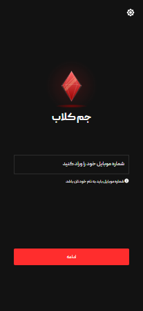
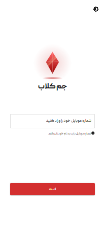
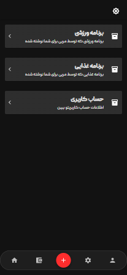

# GemClub Frontend

<div align="center">

   



</div>
This project is a modern frontend application built with **React** and **Vite**, styled using **Tailwind CSS** and configured with **ESLint** for code quality. It provides a strong starting point for building scalable and fast web applications.

## Features

- ⚛️ React for building user interfaces
- ⚡ Vite for lightning-fast build and development
- 🎨 Tailwind CSS for utility-first styling
- ✅ ESLint for consistent code style and linting

## Getting Started


### Installation

Clone the repository and install dependencies:

```bash
git clone https://github.com/mrsedghi/gemclub.git
cd gemclub
npm install
# or
yarn install
```

### Development
Run the local development server:

```bash
npm run dev
# or
yarn dev
Open http://localhost:3000 to view the app in the browser.
```


## Contributing

Contributions are welcome! Please follow these steps:

1. Fork the project
2. Create your feature branch (`git checkout -b feature/AmazingFeature`)
3. Commit your changes (`git commit -m 'Add some amazing feature'`)
4. Push to the branch (`git push origin feature/AmazingFeature`)
5. Open a Pull Request


## Support
If you find this project useful, consider supporting further development!

### 🌍 Iranian Support
<a href="http://www.coffeete.ir/m.r.sedghii" target="_blank">
   
</a>

### 💳 Crypto Support
**TRX (Tron) Wallet:**  
```bash
TXkEs7BHRtV6ffof79Ty92AJW1jYrFRUSY
```

<i>Your support is greatly appreciated! ❤️</i>


## 📜 License

[](https://opensource.org/licenses/MIT)

This project is licensed under the MIT License - see the LICENSE file for details.

## 📬 Contact

**MohammadReza Sedghi**

[](https://t.me/mr_sedghi)
[](mailto:m.r.sedghii@gmail.com)
[](https://github.com/mrsedghi)

**Project Link**:
https://github.com/mrsedghi/gemclub


<div align="center">
Made with ❤️ using React

</div>
